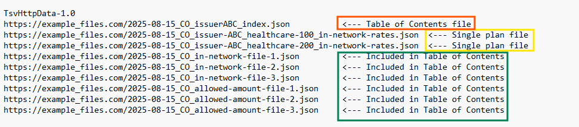

# Colorado Transparency in Coverage

This is the technical implementation guide for the machine-readable files (MRF) in accordance with the Colorado Transparency in Coverage [statute](https://leg.colorado.gov/sites/default/files/2024a_080_signed.pdf) and [rule](https://drive.google.com/file/d/18j0qUEtRuI5EghyKUhChBxI-P6EQNrrz/view). Carriers, plans, and PBMs are expected to adhere to this guidance. Deviations from this guidance may result in penalties for non-compliance.

## Background
The federal government issued Transparency in Coverage [final rules (885 FR 72158)](https://www.federalregister.gov/documents/2020/11/12/2020-24591/transparency-in-coverage) on November 12, 2020, and enforcement began on July 1, 2022.
In 2024, Colorado passed [Senate Bill 24-080](https://leg.colorado.gov/bills/sb24-080) to require insurers, carriers, and pharmacy benefit managers to start posting Colorado-specific healthcare pricing data on July 1, 2025. In April 2025, [regulation 4-2-103](https://doi.colorado.gov/announcements/notice-of-adoption-regulation-4-2-103-concerning-transparency-in-coverage-reporting) went into effect, further outlining the reporting requirements.
The goal of these policies is to make the pricing data more relevant and usable for Colorado consumers, employers, and researchers alike.  
Plans and issuers are required to share these files with the Colorado Division of Insurance ("the Division") beginning on July 1, 2025, and every 6 months thereafter.

## Timeline
Beginning July 1, 2025, and January 1, 2026, and each July and January thereafter each carrier shall make publicly available and submit files to the Division.   
For the first submission, the Division has granted a one-time extension for carriers to submit files on August 15th, 2025.  

## Guidance
The Colorado specific files do not differ from the federal files with the exception of making the files Colorado specific, therefore much of this guidance is a duplicate of what CMS has provided.   
You can find recently released federal guidance here:  
- [CMS TiC GitHub Repository](https://github.com/CMSgov/price-transparency-guide)

## File Submission Guide 
### I. Machine-Readable Files (MRFs)
Pursuant to Regulation 4-2-103, the Division and the Colorado Office of Information Technology (OIT) explored solutions to enable secure, external-facing, and reliable MRF submissions.  The Division will host MRFs via state-managed Cloud infrastructure.

Rather than submitting files through an interface, carriers must provide URLs to their public, Colorado-specific MRFs. Carriers must create a Colorado specific landing page on their website so that the public, Colorado specific MRFs **are not** on the same page as the federal MRFs.

#### Required Submission: one TSV file
Carriers must submit a single .tsv (tab-separated values) file containing:
1. URLs to all Colorado-specific MRFs
2. URL to the Table of Contents file, if applicable
If a Table of Contents file is included, it must be listed as the first entry in the TSV file.

**If a Table of Contents file is used, the individual URLs it contains must still be included in the TSV file.** The Division recognizes that some URLs in the TSV will duplicate those listed in the Table of Contents. This is both acceptable and necessary to meet the technical requirements of Google Cloud Storage Transfer Service.

Below is an illustration of the TSV file:

In addition, all URLs must be publicly accessible and permanent. URLs behind login pages, paywalls, or with expiration dates will not be accepted.

Please follow this guide to format your tsv files: [Formatting URLs for GCP Storage Transfer Service](https://cloud.google.com/storage-transfer/docs/create-url-list#url_list_format), and email your submissions to dora_ins_data@state.co.us by the required deadlines.

For the first submission, carriers must post the MRFs publicly and submit the TSV files to the Division no later than August 15th, 2025. As a reminder, this is a one-time extension of the July 1, 2025 deadline.

### II. RxDC files
#### RxDC File Submission Instructions
The RxDC files may contain personally identifiable information (PII) and must be submitted securely via MoveIt, the State of Colorado’s SFTP system.

**Important**: MoveIt has a file size limit of 1 GB. Carriers and PBMs should either zip files and/or split larger RxDC files into smaller parts to meet this requirement.

#### How to Request MoveIt Access
When your RxDC file is ready for submission, you must follow these steps:

1. Email the following Division contacts with the name and contact information of your organization’s designated data submitter:

- DOI Data Team — dora_ins_data@state.co.us 
- cc: Kate Davidson, Data Science Manager — Kate.Davidson@state.co.us 
- cc: Rachel Zhang, TiC Data Science Lead — Rachel.Zhang@state.co.us 

2. The designated submitter will receive an email from DONOTREPLY@state.co.us with the subject line: “New Package Is Waiting.”

3. This email will include a link for first-time users to create a username and password for the Division’s secure SFTP site.

4. **Access will be valid for 28 days.** If login or submission does not occur within this window, the process must be restarted. As such, the designated submitter will not receive the email to submit the file until days before the deadline. 

For the 2025 submission, please email the designated submitter information to the above email addresses **no later** than August 8, 2025. The submitter can expect to receive the MoveIT email by August 13th, 2025. Carriers, plans, and PBMs are expected to adhere to these timelines. Deviations from this guidance that result in the submitters inability to meet the August 15, 2025 deadline, may result in penalties for non-compliance.

#### Troubleshooting and Support
Existing users can log in with their previously created credentials.

If you experience any issues accessing the site or uploading files, please contact Kate Davidson or Rachel Zhang directly.

## Developer Documentation
### Content Type
In accordance with Regulation 4-2-103, the Division will accept [**JSON**](https://www.json.org/) files. If a carrier can demonstrate a material challenge with creating JSON files, they may request a different format from the Division. Requests must be submitted to the Division two weeks before submission deadlines and must describe in detail the reasons why the carrier cannot create JSON files.  

Examples of formats that do *not* meet the criteria:
- PDF
- CSV
- XLS/XLSX

### Required Files
There are four required files associated with Colorado's Transparency in Coverage requirements:  
1. Table of Contents (JSON)  
2. In-Network Negotiated Rates (JSON)  
3. Out-of-Network Allowed Amounts (JSON)  
4. RxDC Reports (CSV, or consistent with CMS' latest standards)  

**Important Note: Carriers must not embed or reference additional downloadable sub-files within the machine-readable file at any point.**   
For example, carrier submissions must not replace required provider information - such as NPI, TIN type, or TIN value - with a URL linking to a separate JSON file. Submissions that rely on external links or contain large numbers of nested sub-files will not be considered compliant. All required data must be contained directly within the primary machine-readable file.

**1. Table of Contents File**: The Table of Contents file should be leveraged to combine common negotiated rates across multiple in-network files and avoid having to duplicate data. It must include:   
- Carrier name,  
- Plan name,  
- Market segment using the following categories:  
        - Individual, Small Group (<=100 employees>), Large Group (>100 employees); or  
        - TPA, identified by Group EIN or HIOS Plan ID,  
- File generation date,   
- URL link to plan specific files on the carrier’s website, and
- File size:  
        - Provide the **decompressed** file size. For files compressed using .gzip, this refers to the byte size obtained by applying gzip.decompress() to the file content returned from the URL, not the compressed size or the Content-Length of the compressed file.  
        - Format: decimal numeric value with two decimal places, expressed in units of Gigabytes.   
        - The Division is open to receiving a separate metadata file that details file size information.

For reference, here is [the CMS guidance on the Table of Contents](https://github.com/CMSgov/price-transparency-guide/tree/master/schemas/table-of-contents).  

Where plans have the same rates, HIOS Plan IDs or Group EINs can be listed and point to the correct in network files rather than having duplicate files for each plan.  

**2. In-Network Negotiated Rates File**: Under the finalized federal rules, a plan or issuer must disclose in-network provider negotiated rates for all items and services through machine-readable files.  

**3. Out-Of-Network Allowed Amounts File**: Under the finalized federal rules, a plan or issuer must disclose certain data elements to the public, including the billed and allowed amounts for out-of-network providers, through machine-readable files.  

**Colorado Specific In-Network Negotiated Rates and Out-of-Network Allowed Amounts Filter**: The files listed above should be filtered to be Colorado specific in the following manner:  
1. Only include plans issued or delivered in Colorado;
2. Only group or billing NPIs with a corresponding Colorado zip code; and
3. Only negotiated rate and procedure code combinations for providers with 20 or more services performed in the last year, at the procedure code level, not accounting for modifiers. Modifiers must be included in the files, but do not change the count of claims a billing provider has for each procedure code.

- The 20-service threshold should be calculated at the provider level across all plans, not separately by plan. For example: If a provider performed 10 of the same procedure under Plan A and 10 under Plan B, and both plans are offered by the same carrier, the total count is 20, which meets the inclusion criteria.

**4. RxDC reports**: under Section 204 of the CAA, Carriers and PBMs routinely submit information about prescription drugs and health care spending to CMS. This data submission is called the RxDC report, and is what the Division requires through Regulation 4-2-103.   
The only change from what is submitted federally is that files should be filtered to only contain data specific to plans in Colorado. Standards can be found via [this link](https://www.cms.gov/marketplace/about/oversight/other-insurance-protections/prescription-drug-data-collection-rxdc). These reports may contain PII or PHI, as such carriers are not required to post these files publicly. These files should be in .csv format the Narrative Response should be in .pdf or .doc/.docx format.  

Colorado specific filtering for RxDC files:  
- Submitters can use either “aggregation state” in D1-D8 or “states in which the plan is offered” in P2 and P3 to filter these files to make them Colorado specific.  
- The Narrative Response should include which field was used to filter 
- The rest of the Narrative Response can be the same as what is submitted federally, please feel free to add any additional information about the Colorado market and impacts as appropriate.  
- There is no requirement to submit the ‘Drugs missing from the CMS crosswalk’ file 
 

**Provider Reference**: Similar to Federal TiC guidance, carriers are highly encouraged to utilize an optional MRF to significantly decrease file size and promote usability where applicable: [Provider Reference](https://github.com/CMSgov/price-transparency-guide/tree/master/schemas/provider-reference).  
The provider reference file allows the user to define common provider networks externally to the In-Network file that can be referenced from within the In-Network file. This allows large provider networks to be defined once and be used in multiple locations.
 

**Dates**: Files should contain current rates as of the date the files are created. Colorado files that are posted publicly to the carrier’s website should be the current or most recently submitted Colorado file and can be completely replaced once a new Colorado file is submitted (e.g. the January files may replace the previously posted July files).  Carriers do not need to keep historical files posted publicly.  

### Special Data Types
Dates should be strings in [ISO 8601 format](https://en.wikipedia.org/wiki/ISO_8601) (i.e. YYYY-MM-DD).

### Naming Convention  
Carriers should follow the same [naming convention provided in the federal TiC guidance](https://github.com/CMSgov/price-transparency-guide/tree/master?tab=readme-ov-file#file-naming-convention), but shall make sure to add 'CO' between date value and payer/issuer name, in order to distinguish any federal TiC files from Colorado TiC files: 
- `<YYYY-MM-DD>_CO_<payer or issuer name>_<plan name>_<file type name>.<file extension>`.  

**Single Plan Files**  
The following is the naming standard for each file:   
- `<YYYY-MM-DD>_'CO'_<payer or issuer name>_<plan name>_<file type name>.<file extension>`   

An example of a plan named "healthcare 100" with an issuer's name "issuer ABC" producing a JSON file, the following would be the naming output:  
- 2020-01-05_CO_issuer-ABC_healthcare-100_in-network-rates.json  

**Multiple Plans Per File**  
If multiple plans are to be included in a single file, a table-of-contents file will be required. The same naming standard will be applied to the table-of-contents file.  
The following is the required naming standard for the table-of-contents file:  
-  `<YYYY-MM-DD>_'CO'_<payer or issuer name>_index.<file extension>`

For example, the following would be the required naming for issuer ABC building a JSON file that includes multiple plans:  
- 2020-01-05_CO_issuer-ABC_index.json

### Public Discoverability
Under Section 5-C of Regulation 4-2-103, carriers shall include the URL link(s) to the files on their website. RxDC reports are not required to be posted on the website.  
#### Robots.txt
To allow for search engine discoverability, neither a robots.txt file nor meta tag on the page where the files are hosted will have rules such that give instructions to web crawlers to not index the page.
This typically follows the format of or for a robots.txt file using the Disallow directive.

### Federal Schemas  
With the exception of Table of Contents and one field in In-Network File, the Division will not publish its own schemas, since the content required is near-identical to that of the federal schemas. Instead, below are the links to the most current federal TiC file schema:  

[link to In-Network Rates Federal schema](https://github.com/CMSgov/price-transparency-guide/blob/master/schemas/in-network-rates/README.md)   
[link to Allowed Amounts Federal schema](https://github.com/CMSgov/price-transparency-guide/blob/master/schemas/allowed-amounts/README.md)  
[link to Table of Contents Federal schema](https://github.com/CMSgov/price-transparency-guide/blob/master/schemas/table-of-contents/README.md)  
[link to Provider Reference Federal schema](https://github.com/CMSgov/price-transparency-guide/blob/master/schemas/provider-reference/README.md)  

[Link to Colorad-specific Table of Content Schema](Schemas/table-of-contents/README.md)

### Examples  
[link to implementation examples](https://github.com/CMSgov/price-transparency-guide/tree/master/examples)  

## Exemption Process
Carriers who have **less than 30** enforced policies across the company’s combined plans may request an exemption by contacting the Division at the email address below.  

## Contact the Division
Please contact dora_ins_data@state.co.us for any questions or concerns.

